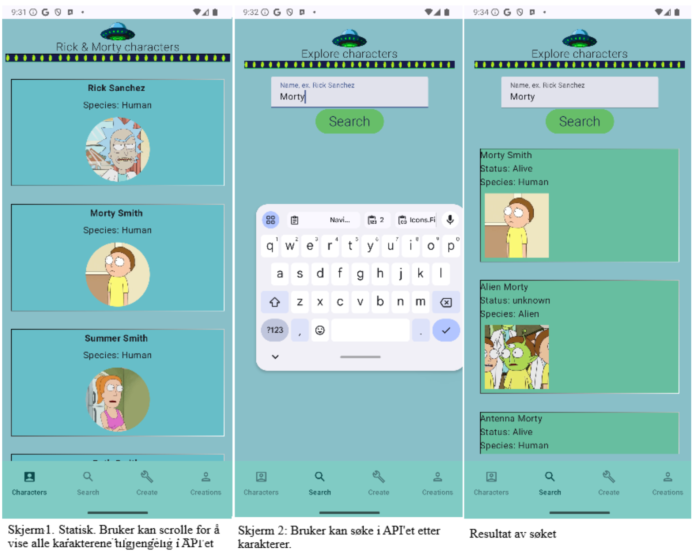
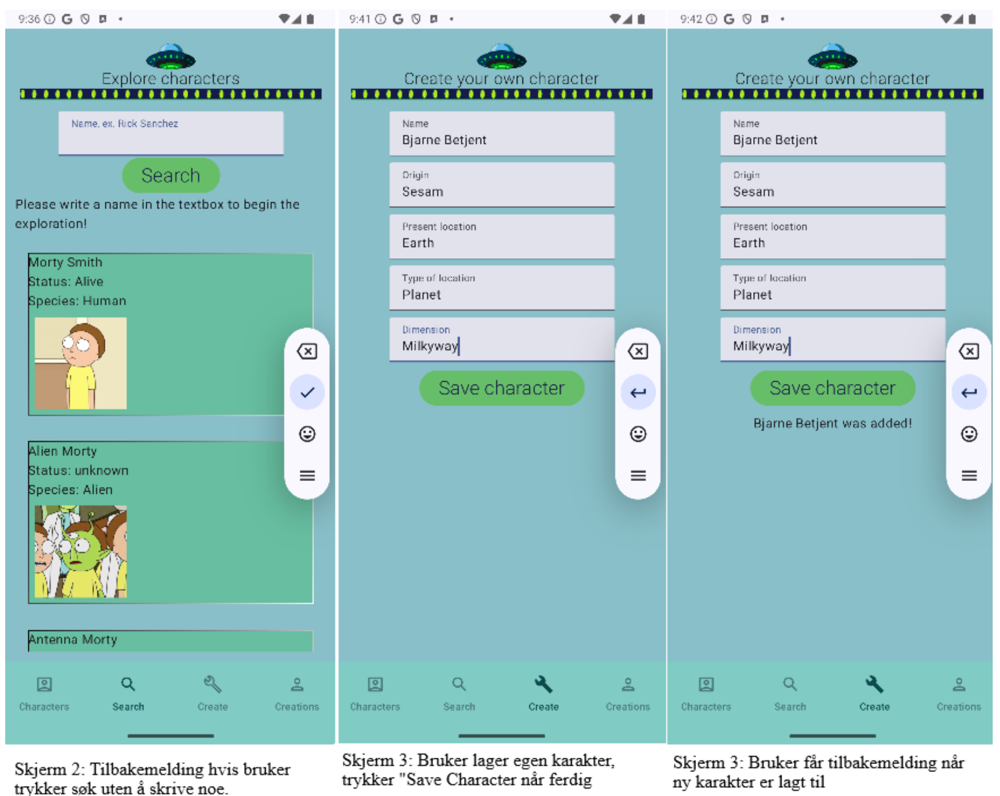
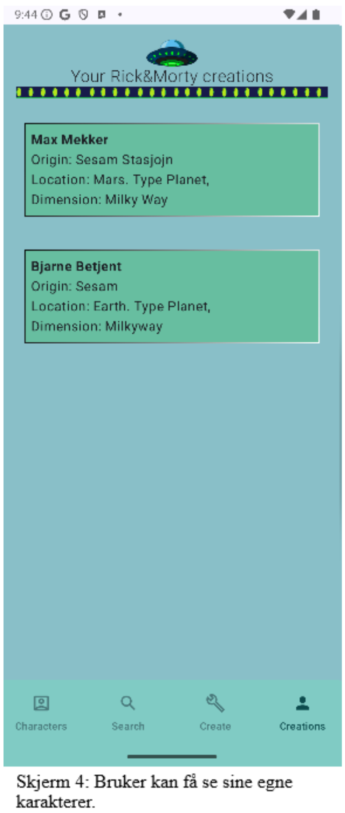

# Android Development Exam Autumn 2024

### Run the project
- Clone repo using web URL: ``git clone https://github.com/e-arevoll/AndroidDevelopment-exam-H24.git ``
- Open Android Studio, navigate to cloned folder and select it.
- Run the app either on a selected device or the Android Studios simulator.
- Click play, and remember, give it some time for the apps content to load : )

### Overview and notes
## Case: Rick & Morty App
We were tasked with creating an app for fans of the show Rick and Morty, where a feature of the app was letting the fans create their own character. 
We had to create 4 screens
#1 Show characters from rickandmortyapi.com
#2 Show the user's own characters
#3 A screen where the user can create their own character
#4 A screen of our own choosing, I made a screen where you could search for any character from the API. 

In the report is a full review of the functionality of the app, main techniques, quality and structure and screenshots. This report is written in Norwegian. 
More detailed information, including functionality demanded for this exam can be found in "PGR208-Android-Programming-Høst-2024.pdf". This document is also in Norwegian.
#### Technologies and key features
- **Room**, a library using SQLite-database on Android devices.
- **RetroFit**, technique to make HTTP-calls towards the Web API
- **Tools**: Android Studio, Jetpack Compose, rickandmortyapi.com
### Preview

